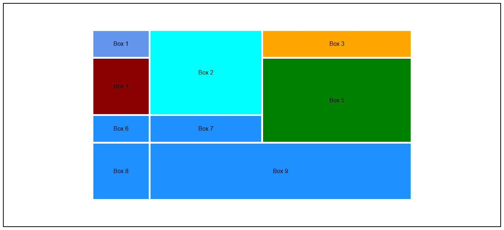

# Lab Task 4 – Grid Layout Based Web Page BoxDesign

This project is a hands-on assignment designed to strengthen understanding of **HTML** and **CSS**, with a focus on the **CSS Grid Layout** model.  
Students practiced building a multi-box grid layout using column and row spanning, precise item positioning, and grid-based design principles.

---

## 📋 What's Included

A grid-based layout built using **HTML** and **CSS Grid**:

- A grid container with multiple boxes (Box 1 to Box 9) styled in various colors.
- Manual item placement using `grid-column` and `grid-row`.
- Items spanning across multiple columns and rows using `span` or defined start/end lines.
- Application of gaps, borders, and background colors for layout clarity.
- Vertical and horizontal alignment of items within the grid.
- A practical demonstration of positioning a grid item over another's space.

---

## 💡 Key Concepts Practiced

- **CSS Grid Layout Basics** (`display: grid`)
- **Grid Template Definitions** (`grid-template-columns`, `grid-template-rows`)
- **Row and Column Gaps**
- **Grid Item Placement** using:
  - `grid-row`, `grid-column`
  - `grid-row-start`, `grid-row-end`
  - `grid-column-start`, `grid-column-end`
  - `grid-row: span n`, `grid-column: span n`
- **Centering Grid Items** (`align-items`, `justify-items`, `place-items`)
- **Spanning and Overlapping Items**

---

## 🔗 How to View

- Open the `index.html` file in any modern browser.
- Ensure the `style.css` file is linked properly to see the full grid layout.
- All elements will appear as colored boxes positioned using grid techniques.

---

## 🔗 Live Preview
Click Below:
-
[View Preview](https://raw.githack.com/Ayesha-Rajput/Web-Design-and-Development_SE_3208/main/2022-SE-03_Lab_task_04_WDD_BoxDesign_Using_Grid_Layout/index.html)

## Lab Task Design

> ⚠️ **Note:** This preview is taken from a local browser. In some cases, external font rendering or image paths may not load correctly via online preview links.

---

## 📁 Repository Info

All project files, including **HTML** and **CSS**, are included in this repository.  
This task was developed as part of coursework to practice Grid Layout in modern front-end development.  
Further updates and enhancements may be added in the future as learning progresses.

